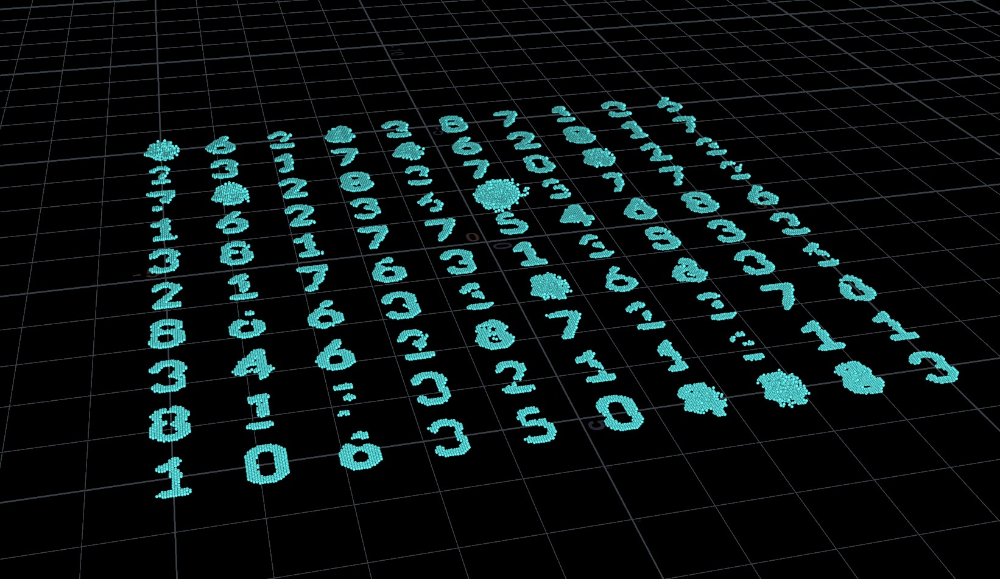

# 



Project using Python 3.8.6

Run these commands to set up virtual environment for 3dgan:
```
python -m venv ./venv/
source ./venv/Scripts/activate
pip3 install torch torchvision torchaudio --index-url https://download.pytorch.org/whl/cu117
pip install tqdm
```

